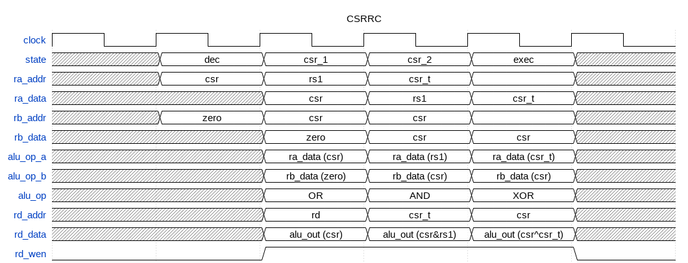

# FWRISC Design Notes

## Execution State Machine
fwrisc uses a state machine to implement instruction execution. Most logical and arithmetic instructions execute in three cycles (Fetch, Decode, Execute). Memory instructions have an additional MEMR or MEMW state. CSR instructions use several states to implement the atomic read/modify/write
behavior of these instructions.

## Memory Interface
The memory interface for both the instruction-fetch and data interfaces follows a simple valid/ready handshake scheme. 

Reads begin with the core asserting VALID along with the address. Read data is sampled when the READY signal is also high.

Writes begin with the core asserting VALID along with address, data, strobes, and write. The cycle terminates when the READY signal
is also high.

## Register File
fwrisc uses FPGA blockram to implement the core RISC-V registers, as well as the CSRs. Currently, dual-port
full-width RAM is used to increase performance.

## Performance Counters
Compliance with the RISC-V spec requires that MCYCLE and MINSTR counters be implemented that track, respectively, the number of cycles since some point in the past, and the number of instructions executed since some point in the past. Limiting the size of an FPGA implementation requires minimizing the number of required flip-flops. As a consequence, these counters are maintained within the register memory block. Updating these 
registers every cycle would impose an extraordinary overhead on performance, so two small 8-bit counters are used to maintain an intermediate 
cycle and instruction count. When the cycle count exceeds half its capacity, the copy of the MCYCLE and MINSTR registers are updated with the
number of cycles and instructions executed since the last update. This minimizes the resource overhead of maintaining these counters, while
maintaining adequate performance.

# CSR Instructions
The CSR instructions require several steps to execute: 
- reading the target CSR and (optionally) storing the unmodified version to the destination register
- (optionally) Modifying the target CSR based on rs1 and the instruction type
- (optionally) Writing the modified CSR value back to the CSR. 

In all cases, a temporary register (CSR_tmp) is used to store intermediate values during the read/modify/write operation.

The following diagram shows how a basic CSRRW instruction is implemented

The CSRRC instruction is implemented by AND-ing the CSRRC argument with the CSR value to form a clear mask, then
XOR-ing that mask with the CSR value to derive the new CSR value.

