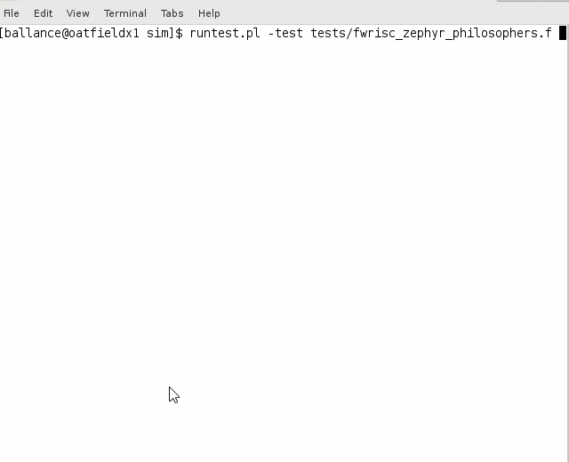

# FWRISC Quickstart

This Quickstart guide describes the process for getting up and running with FWRISC. Follow the process
described below 

## Setup Tools

Please see the [Tools](fwrisc_tools.md) page for information on the tools required to run FWRISC. 
Please install the required tools and configure your environment before proceeding.

## Setup FWRISC Project

Please see the [Setup](fwrisc_setup.md) page for information on cloning and bootstrapping the
FWRISC project.

## Run Regression Tests

The block-level regression tests can be run using the following steps. Note that the
FWRISC environment-setup script must have previously been sourced:

```
% cd fwrisc/ve/fwrisc/sim
% runtest.pl -testlist testlists/fwrisc_riscv_all_tests.tl
```

The runtest command above will run unit tests, RISC-V compliance tests, and simple Zephyr tests. You should see 
something like the following after the test run completes:

```
#*********************************************************************
# PASSED:  120
# FAILED:  0
# UNKNOWN: 0
# TOTAL:   120
#*********************************************************************
```


## Run Zephyr Examples
Two of the Zephyr examples, synchronization and philosophers, are much more visual and do not terminate.
Running these tests interactively is recommended.

### Run "philosophers":

```
% cd fwrisc/ve/fwrisc/sim
% runtest.pl -test tests/fwrisc_zephyr_philosophers.f
```

You should see something like what is seen below:




### Run "synchronization"

```
% cd fwrisc/ve/fwrisc/sim
% runtest.pl -test tests/fwrisc_zephyr_synchronization.f
```

You will see several messages from threadA and threadB, which the testbench monitors to determine
when the test has passed. Note that the test specifies special flags to the test compilation
to shorten the test run.

### Run "dhrystone"

```
% cd fwrisc/ve/fwrisc/sim
% runtest.pl -test tests/fwrisc_zephyr_dhrystone.f
```

You should see the following:
```
# ***** Booting Zephyr OS zephyr-v1.13.0-1808-gd18ff80 *****
# start=70458 ; end=1873006
# Microseconds for one run through Dhrystone: 72
# Dhrystones per Second:                      13500
```

Note that the clock for this test is 50Mhz, resulting in 0.15 DMIPS/Mhz.

## Run Synthesis
Please see the [Synthesis](fwrisc_synthesis.md) document for more information on running synthesis. The short version is:

- Ensure your environment is properly configured
- cd fwrisc/synth/microsemi
- make
- cd fwrisc/synth/lattice
- make


